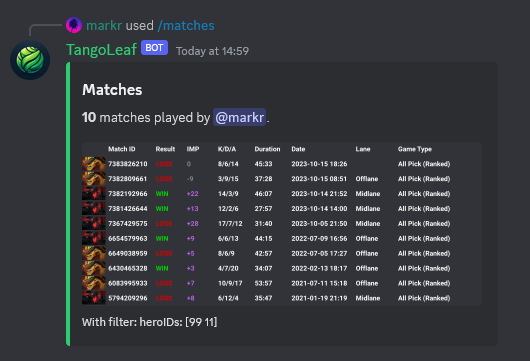
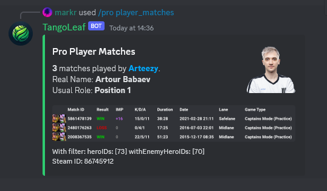
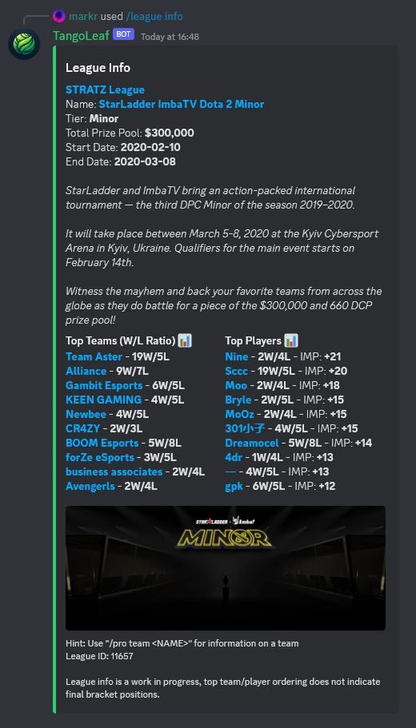

# TangoLeaf
TangoLeaf is a Dota2 Discord bot that enhances your server by offering Steam account login, match history viewing, stats for pro players and leagues, and much more. Its goal is to bring a unified Dota2 community experience to your server.

- Join the [TangoLeaf Discord](https://discord.com/invite/EcqKMrzw5b) to use the bot and receive support
- Invite the [TangoLeaf Bot](https://discord.com/oauth2/authorize?client_id=1161638349421940786&permissions=551903676480&scope=bot) to your own Discord server
- View the [TangoLeaf Docs](https://docsify-this.net/?basePath=https://raw.githubusercontent.com/mark-ruddy/tango_leaf_docs/main&homepage=usage.md&dark-mode=true&browser-tab-title=TangoLeaf#/)

## Contents

- [Commands](#commands)
- [Steam Account Integration](#steam-account-integration)
- [Match Filtering](#match-filtering)
- [Match Info, Last and Chat](#match-info--last-and-chat)
- [Pro Scene Stats](#pro-scene-stats)
  * [Players](#players)
  * [Leagues](#leagues)
- [Meta](#meta)

### Commands
To find the latest commands run `/help general` and from there run the subcommands such as `/help match` to view the commands relating to matches:

### Steam Account Integration
Run the `/login` slash-command on Discord which will give you a link to the Steam login page:

Once logged in TangoLeaf will show you in the list of `/linked_accounts` in any Discord server where the bot is present:

You can also now run commands that take a SteamID(such as `/matches`) without needing to specify it. You can still provide a different SteamID if you want to use it for a different account:

Other people in the discord server can now `@mention` you instead of needing to copy-paste your SteamID, for example to view your recent matches:

### Match Filtering
TangoLeaf provides advanced match filtering that can be used across multiple commands - `/matches`, `/pro player_matches` and `/league matches`.

Lets say you want to print your 10 most recent matches as either Shadow Fiend or Bristleback - `/matches heroes: bb,sf`:

Getting more granular, find your most recent Bristleback offlane matches where you played against a Phantom Assassin and also print the Match IDs - `/matches print_ids: true heroes: bb with_enemy_heroes: pa lanes: offlane`:

Get Arteezy's Alchemist games where he played against an Ursa - `/pro player_matches player: arteezy heroes: alchemist with_enemy_heroes: ursa`:

Get matches in the Bali Major 2023 where Lion was picked - `/league matches league_id: 15438 print_ids: true heroes: lion`:

### Match Info, Last and Chat
Get detailed information about a match. A tip is when filtering matches, use the `/matches print_ids: true` option to find the Match IDs you want. You can then use that Match ID in these commands - `/match info match_id: 7381504884`:

Get info on your last match or a filtered match from the perspective of one player, the basic use is to be logged in and run `/match last` to see your most recent match. Another example would be using it with a `@mention` and a hero filter, this example will get `@markr`'s last match as puck - `/match last steam_id: @markr heroes: puck`:

View the all chat logs for a match. Here is a calm example as it's from a pro match - `/match chat match_id: 7233123840`:

### Pro Scene Stats

#### Players
To get information on a pro player you can specify their handle, alias or real name. This is an example for n0tail - `/pro player_info player: n0tail`:

As seen in the previous match filtering section, you can also find the matches for a pro player. This example uses n0tail's alias - `/pro player_matches player: BigDaddy`:

#### Leagues
Find league links and IDs and filter by tier and ended status. This will work for all registered Dota2 leagues, not only professional ones. - `/leagues tier: minor`:

Once you know the league ID that you're interested in, you can get info on it - `/league info: 11657`:

And as seen before you can use `/league matches` with filtering to find matches in a league. Here is example for all games in TI12 that had either Rubick or Invoker picked - `/league matches leauge_id: 14268 heroes: rubick,invo`:

### Meta
TangoLeaf currently has one meta command with more planned for development.

To display a table with information on how a hero performs playing with or against other heroes in the recent meta. For example Phantom Assassin's matchup info - `/meta hero_matchups hero: pa`:

